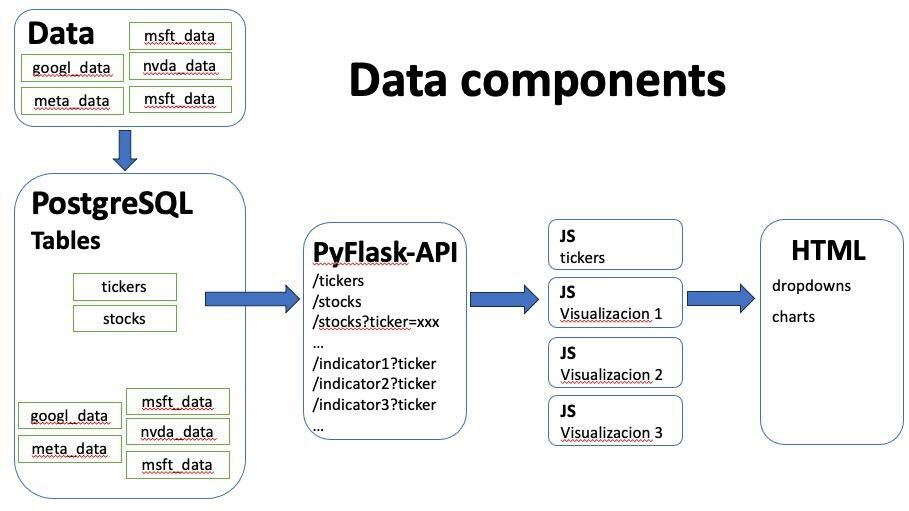

# Project 3 -  Group 1

- Alex H
- Maria Kouider
- Lina Orjuela
- Ricardo Andrés De los ríos Hernández

## Industry: Finance

### Introduction

In this project, the analysis of the historical stock prices of the five main companies in the technology industry (**Apple, Nvidia, Microsoft, Google (Alphabet Inc.) and Meta Platforms, Inc.**) will be carried out. To understand the trends, patterns and underlying dynamics of the tech industry giants.

This academic exercise seeks to harness the power of programming languages and tools such as JavaScript, Python, PostgreSQL, along with libraries such as sqlalchemy, dotenv, Flask, D3.js, Plotly and Widget. Through these tools we delve into the analysis of historical stock prices (January to September 2023).

### Question

#### ¿What are the historical stock prices over 9 months of the top 5 biggest technology industry players?

### Motivation
The need to understand how these leading companies in the technology sector have evolved in terms of market value in the period from January to September 2023. This data can be useful for investors, financial analysts, and people interested in the dynamics of the stock market, as it would allow them to identify patterns, trends, and investment opportunities based on the past performance of these companies. Additionally, it could help evaluate the impact of specific events, such as product launches, industry news, or changes in company management.
 
### Why people would visit our webpage? 
- Gain insight on historical performance of stocks and get an analysis for top 5 biggest technology industry players.
- Provide analysis.
- Visual representation that help to prove the provided analysis.

### Installation

### Data Sourcing
- API Yahoo + Python: we use: https://pypi.org/project/yfinance/

### Data Componenent 

### How to naviguate our webpage ? 
- Dropdown:
- 

### Visualization - Candlestick Chart 

### Visualization - Bar Chart 

### Visualization - Pie Chart 

### Overall Analysis 

### Slides Link

